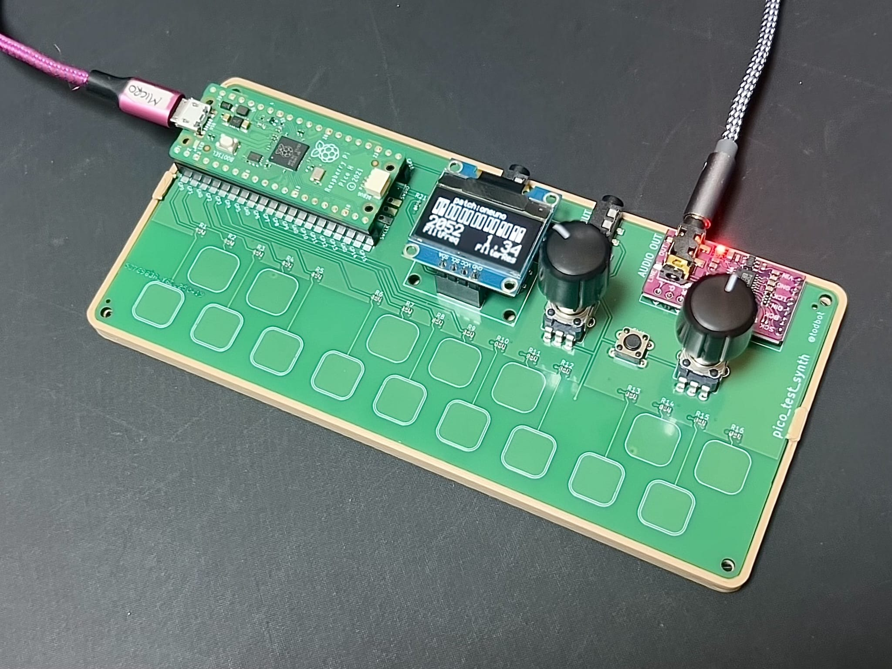
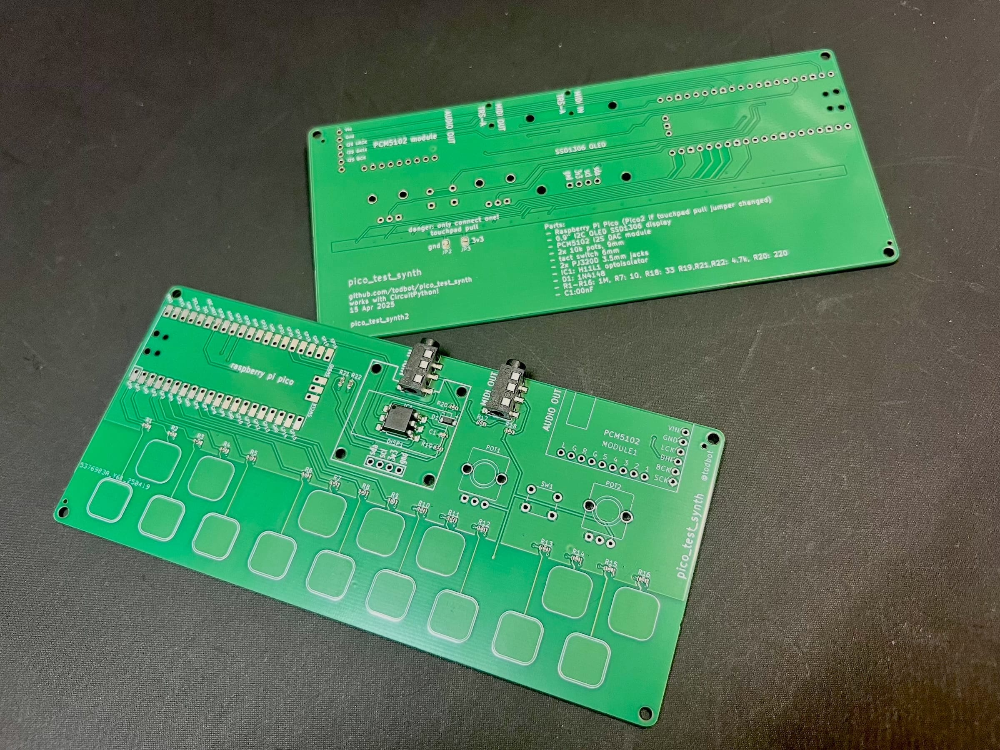
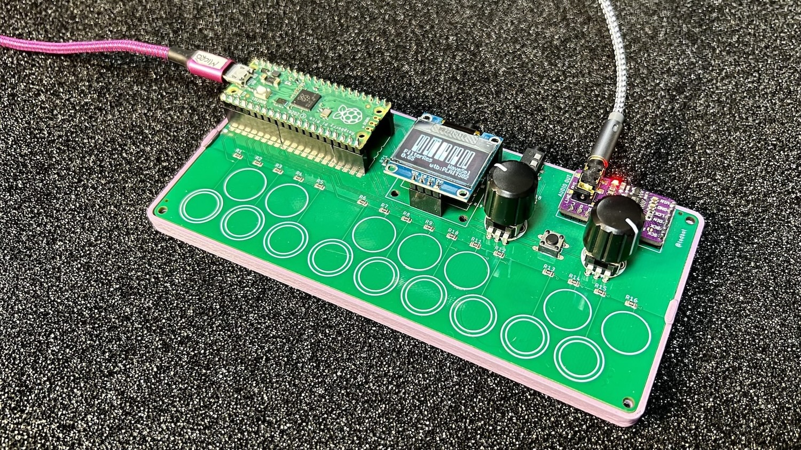
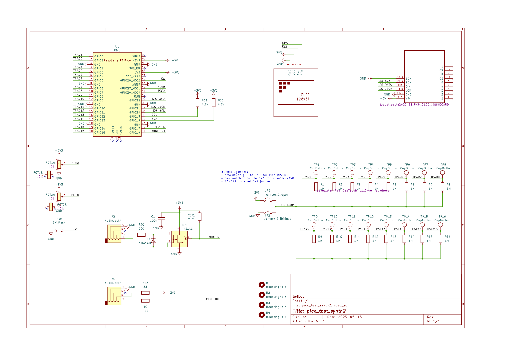

# pico_test_synth

A simple 
[Raspberry Pi Pico RP2040](https://www.raspberrypi.com/documentation/microcontrollers/raspberry-pi-pico.html)-based
synth to experiment with [`synthio`](https://github.com/todbot/circuitpython-synthio-tricks) and [Mozzi](https://github.com/sensorium/Mozzi).

<h3>pico_test_synth2</h3>

<h3>pico_test_synth, the original</h3>

<h3>video demo</h3>

** **[Available on Tindie](https://www.tindie.com/products/todbot/pico_test_synth/)** **

### Features

* [PCM5102 I2S DAC](https://todbot.com/blog/2023/05/16/cheap-stereo-line-out-i2s-dac-for-circuitpython-arduino-synths/) footprint for high-quality stereo audio out
* Optoisolated MIDI Input via [MIDI TRS-A 3.5mm jack](https://www.perfectcircuit.com/make-noise-0-coast-midi-cable.html)
* MIDI output via MIDI TRS-A 3.5mm jack
* Two pots for controlling parameters
* One switch for controlling parameters
* 16 capsense touch buttons for synth triggering
* USB MIDI in/out of course too
* **(NOTE: the pico_test_synth1 PCB will NOT work with the Pico2, since its RP2350 chip has a hardware error)**

### Software

Programs written for [`qtpy_synth`](https://github.com/todbot/qtpy_synth/)
will work with this board too with minimal changes.

Some programs written specifically for this board:

* [hwtest](https://github.com/todbot/pico_test_synth/tree/main/circuitpython/hwtest/code.py) - test out the hardware with a simple synth
  * [video demo](https://www.youtube.com/watch?v=9U2Dn7ckdbs)
* [wavesynth](https://github.com/todbot/pico_test_synth/tree/main/circuitpython/wavesynth/) - port of wavesynth for qtpy_synth board with some improvements

More code specific for this board coming!

#### See also:
- https://github.com/todbot/circuitpython-synthio-tricks
  - Contains [many other synthio examples](https://github.com/todbot/circuitpython-synthio-tricks/tree/main/examples) that can work with this synth with minimal changes

### Enclosure

As seen in the top photo, there's a very simple [3d-printable enclosure available on Printables](https://www.printables.com/model/784414-case-for-pico_test_synth-circuitpython-synthesizer). You can snap the PCB in to quickly get started,
or use M2.5 screws and nuts to secure the PCB more permanently.

### Pins used

The board uses all of the Raspberry Pi Pico pins:

* `board.GP28` - middle button
* `board.GP27` - right knob
* `board.GP26` - left knob
* `board.GP22` - I2S data
* `board.GP21` - I2S LR  clock
* `board.GP20` - I2S bit clock
* `board.GP19` - I2C SCL for OLED display
* `board.GP18` - I2C SDA for OLED display
* `board.GP17` - TRS UART MIDI in
* `board.GP16` - TRS UART MIDI out
* `board.GP0`..`board.GP15` -- touch pads 1-16

For more details see [`hwtest/code.py`](https://github.com/todbot/pico_test_synth/tree/main/circuitpython/hwtest/code.py).

### Schematics

#### pico_test_synth2 ####

#### pico_test_synth, original ####

